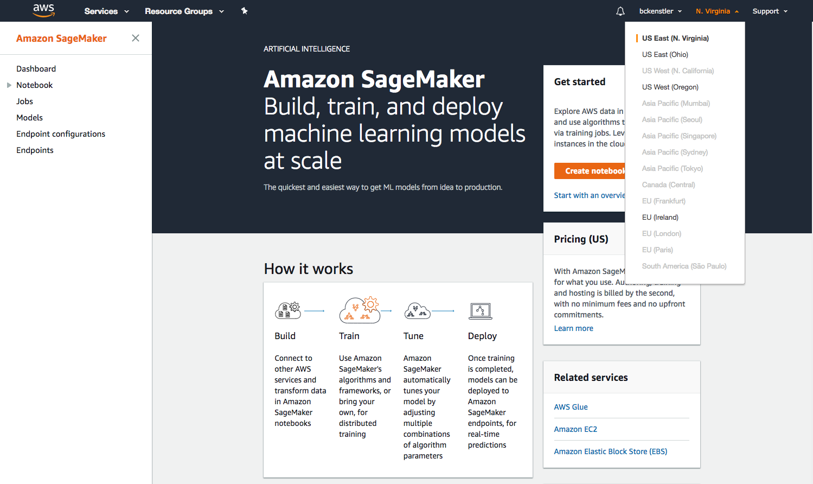
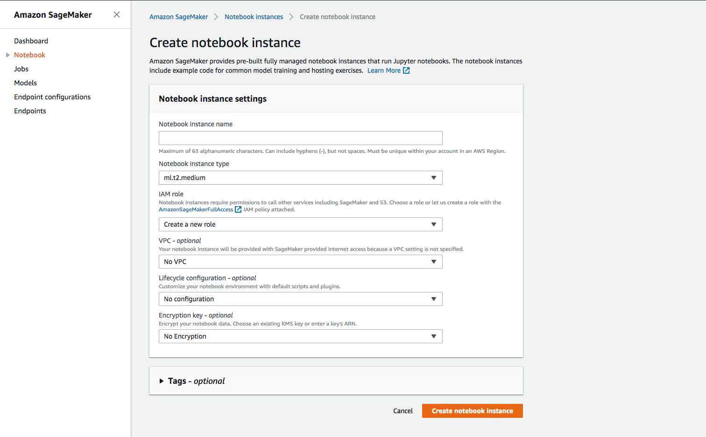
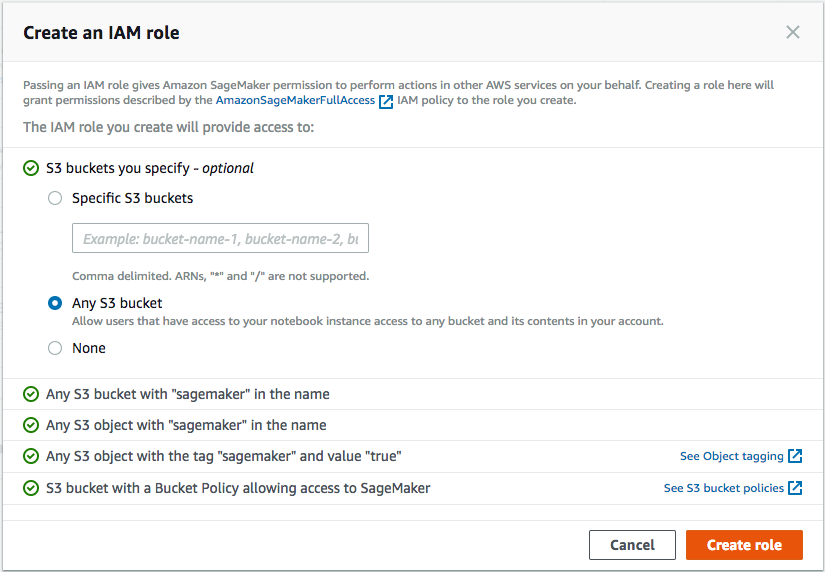
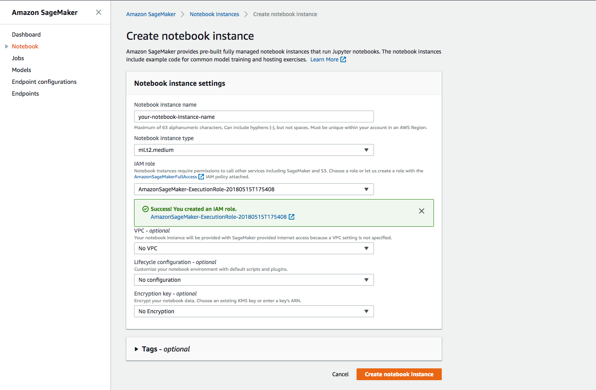
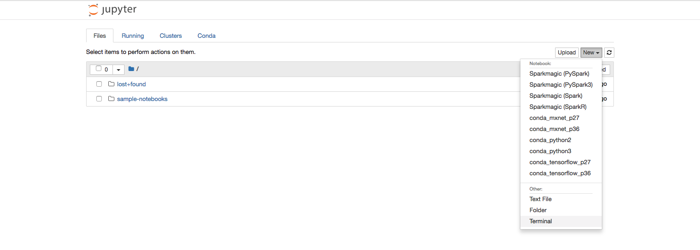
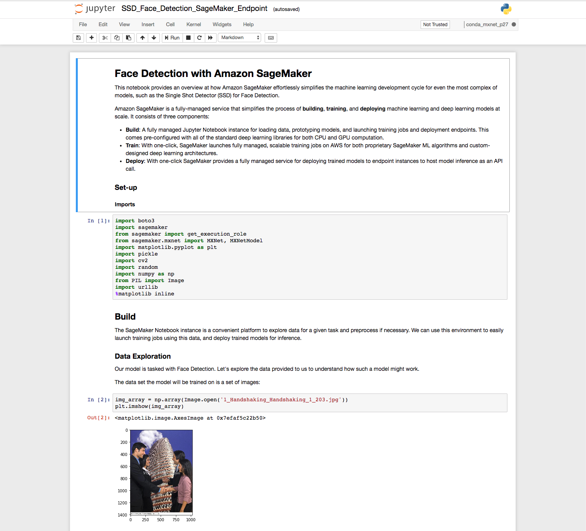
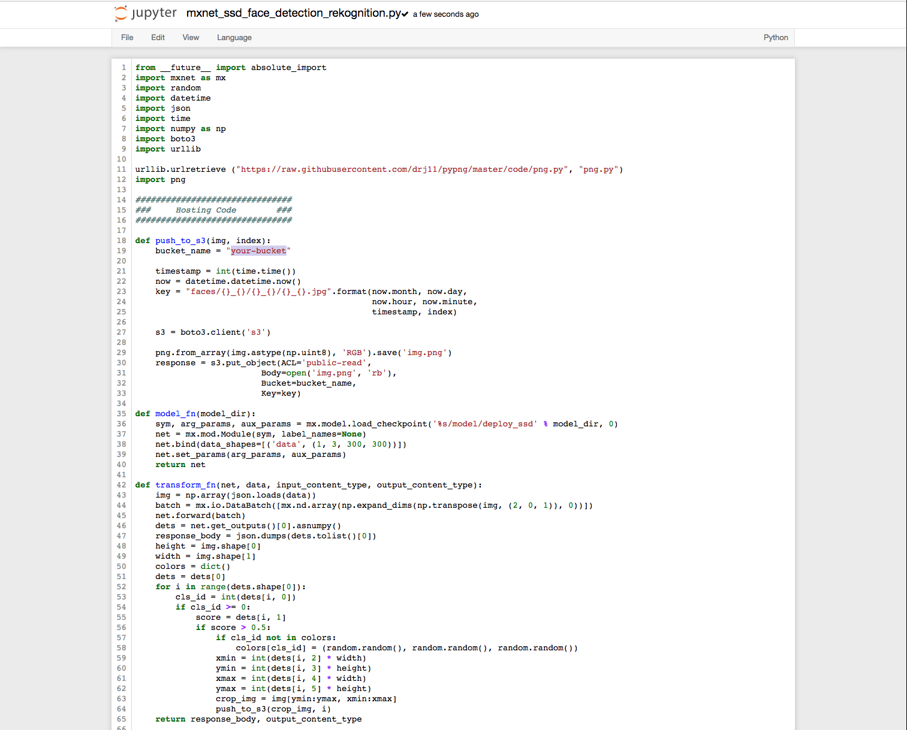

# Challenge 1: Launching a SageMaker Endpoint for Face-Detection

## Summary

The first stop in the pipeline of your Crowd Emotion Tracking App is a face-detection model. Recall that we'll be using Rekognition to detect face emotions. Rather than sending a stream of raw images to Rekognition, we're going to pre-process images with the face-detection model to:
* Only send images to Rekognition when a face is detected
* Only send the actual face crop itself

This limits both the number of API calls we make, as well as the size of content we send.

In this challenge, you will use SageMaker in your efforts to deploy a face-detection model. You will first launch a SageMaker notebook instance; from your notebook, your will be able to explore the data your model will train on, see how the model is trained, and deploy a pre-trained model to an inference endpoint. You will also create an S3 bucket for the endpoint to store detected faces, which you will need to develop you Crowd Emotion Tracking App.

## Instructions

### Launching a SageMaker Notebook Instance

Go to [https://aws.amazon.com/](https://aws.amazon.com/) and either sign-in or create an account.

Next, at the home console screen, type in "SageMaker" into the search bar and click "Amazon SageMaker":


Next, you should find yourself at the Amazon SageMaker home page (if not, click "Amazon SageMaker" on the top left sidebar).
Please click the drop-down menu between your account name and "Support" and select "US East (N. Virginia)". Many resources we will be using in this workshop are in region us-east-1, so we need to make sure we launch SageMaker services in the same region.



Next, click the orange "Create notebook instance" box on the panel in the upper-right side of the screen. You should find yourself here:



Amazon SageMaker provides pre-built fully managed notebook instances that run Jupyter notebooks. Here, we're going to configure our notebook server:
* Under Notebook instance name: Enter a name for your notebook instance
* Under Notebook instance type: Select an instance type (recommend using default "ml.t2.medium")
* Under IAM Role: Select "Create a new role"

When you click "Create a new role", a pop-up window will appear that will let you configure S3 access for your SageMaker IAM role. Please select "Any S3 bucket", then "Create role".



You should see a "Success" message once you create the role (it will have a different name than the one shown here).



And click "Create notebook instance" on the bottom right. You should be re-directed to the notebook dashboard where you will see the instance status is "Pending". SageMaker is spinning up the notebook instance, this should take 5-10 minutes.


### Creating an S3 Bucket

While the notebook instance is launching, we're going to create an S3 bucket. S3 is an object storage service, and we'll use this bucket later to store crops of detected faces. To reach the S3 dashboard, click "Services" on the top left and type in "S3" into the search bar.


Once there click "Create bucket":


A window should pop-up:
* Under bucket name: Enter your bucket name
* Under region: select "US East (N. Virginia)"

Click "Create" at the bottom right.


Great, now you've created a bucket for storing face crops. Keep track of the name of the bucket, as we'll be using it shortly. 

Let's navigate back to the SageMaker console in the same way we got to the S3 console, by clicking the "Services" tab and searching "Sagemaker".

### Deploying the Face-detection Model

Once back in the SageMaker console, select the "Notebook" tab from the sidebar on the left. You should see the same notebook screen as before, only now instead of "Pending", the status should read "InService" (if not, please wait a bit longer). Next, click "Open" under "Actions" to open your notebook instance.


You'll be redirected to the notebook instance, and will land in the jupyter notebook dashboard. From here, you can navigate through your local filesystem, open and edit notebooks, text files, terminals, etc. By default, you'll have two directories: "lost+found" and "sample-notebooks", the latter of which contains a litany of examples for building, training, and deploying algorithms on SageMaker.

The "New" tab on the top right can be used to create new files, as well as open up a terminal window through the dashboard. We need to clone a github repository, so let's open up a new terminal:



Once in the terminal, run the following commands to clone the repo into the dashboard's root directory:
```shell
cd SageMaker/
git clone https://github.com/kenstler/aws-ml-iot-lab.git
```


Next, close the terminal tab and go back to the dashboard. You should see a new folder, "aws-ml-iot-lab". 


Select that folder, then select the folder "Challenge_1". You should see contents similar to this:


Next, click on "SSD_Face_Detection_SageMaker_Endpoint.ipynb" to open up the notebook. You should now be looking at a Jupyter notebook:



A Jupyter notebook is essential an interactive document that processes code blocks and produces output. You can navigate through the code blocks using the arrow keys; the code block you're currently on will be highlighted in a box with a blue edge. You'll notice that there are two kinds of blocks, Markdown blocks and code blocks. 

The markdown blocks are just there to provide accompanying documentation to the notebook, but we actually want to run the code blocks. To do this, simply click **Control+Return** while over a code block. This sends the code block to an ipython kernel that runs the code sequentially like a script, and returns any output. 

The ipython kernel keeps track of the state of the code ran so far, so it's important to run code blocks sequentially from the top-down so it can process in the correct order. When you run a code block, the "In" next to the block indicates the state of the kernel; it will either show a "\*" to indicate that the code block is still processing, or it will show an integer that shows the order in which the blocks were run since the notebook was launched. (These are already there by default).

Please proceed to run each code block, until you're told to return to these instructions

Once you've reached **STOP**, you'll have seen the inference code and will likely have guessed that we need to insert the S3 bucket name you created into the "<your-nucket-name>" placeholder. To do this, go to the jupyter dashboard, and open "mxnet_ssd_face_detection_rekognition.py".

The dashboard will then open a text editor. Once there, replace the "your-bucket" (highlighted) with the bucket name you created earlier:



Once you've done that, save the document and close the window. Now, go back to the notebook and continue to run the rest of the code-cells.

By the end of the notebook, you should have successfully launched a SageMaker endpoint that is running inference with a face detection model, and have sent a test image to the endpoint. The endpoint will have returned the detections, but it also will push the face crops to S3.

You can check this by going to your S3 bucket, where you'll find two objects uploaded to the bucket; the two face crops from the test image.

You've now completed Challenge 1.


