# To-do

## Instructions

## Configure GreenGrass on IoT Device
**[Mahendra content here]**

## Deploy Lambda Code to IoT Device
**[Mahendra content here]**

## Create Rekognition Lambda

Now that we've configured our IoT device to send images to our SageMaker endpoint, we've completed the first two stages of our pipeline. The last stages include processing our face crops through Rekognition to extract emotion scores, storing scores in a DynamoDB table, and pushing scores to Cloudwatch so we can build a dashboard to track emotion metrics.

We're going to use AWS Lambda to create a script that does all three of these things every time a face crop is pushed to S3. Navigate to the Lambda console and under the "Function" Dashboard select "Create function" as you did before. This time we'll be authoring a function from scratch:

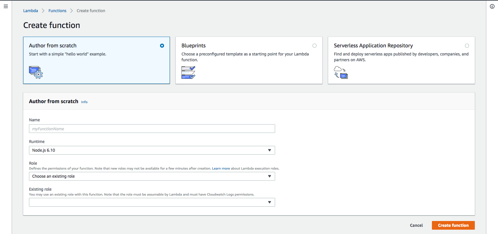

Next:
* Under Name: enter your rekognition lambda name
* Under runtime: enter "Python 2.7"
* Under role: Select "Create new role from template(s)"
* Under role name: Enter your rekogition lambda role name
* Under Policy templates: Add "S3 object read-only permissions"

Then click "Create function."

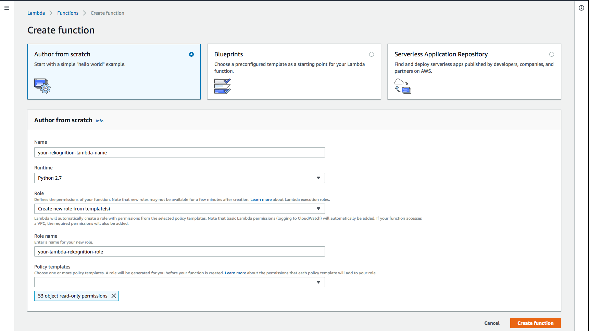

You should now be on the lambda function screen. Before we start editing the lambda, we need to assign additional permissions to the lambda role. As you can tell from the services listed on the right, we currently only have access to "Amazon CloudWatch Logs" and "Amazon S3".

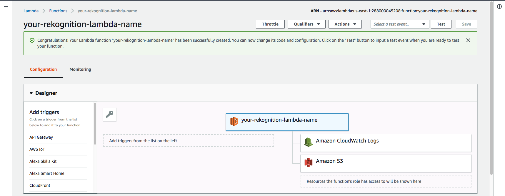

We need to add permissions for Rekognition and DynamoDB. Navigate to the IAM dashboard by searching for "IAM" in the "Services" drop-down. Once there, click "Roles" on the left side-bar and type in your rekognition lambda role name.


Select your role, and you should see two policies already created from the template.

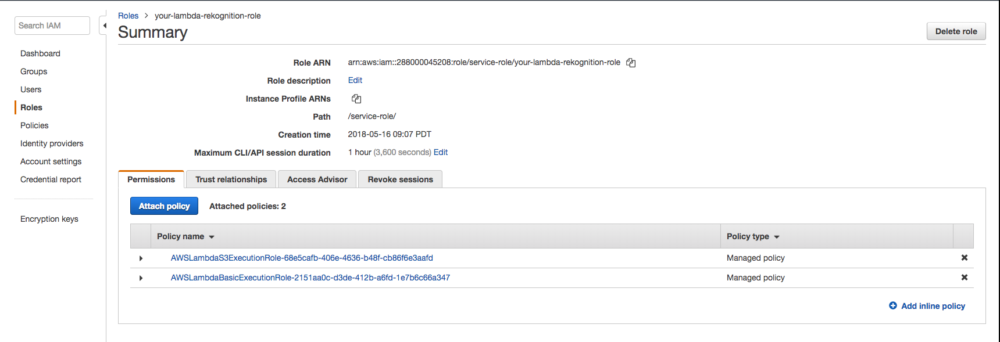

Select "Attach Policy". First, search for "DynamDB", and select "AmazonDynamoDBFullAccess". 


Next, search for "Rekognition" and select "AmazonRekognitionFullAccess".


Then, click "Attach policy", and you should now see these policies attached to your role.

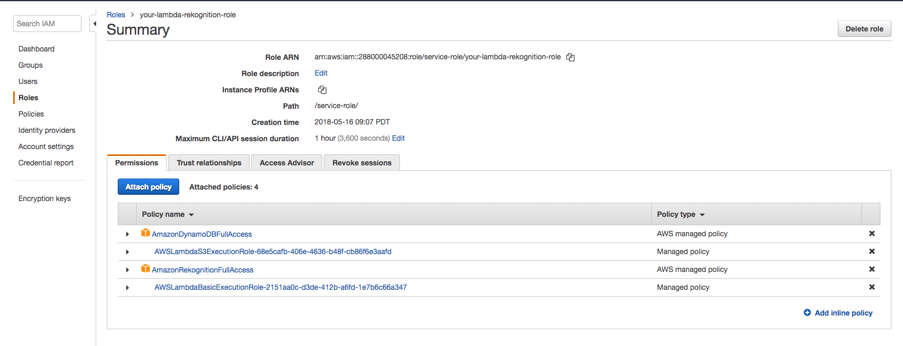

Back on the lambda function page, we can now see additional resources available to us on the right. 

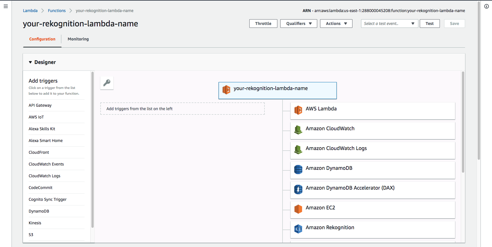

We know that we want this lambda script to run everytime a face crop is uploaded to S3, so let's add an event trigger to this Lambda. On the left, you'll see a list of triggers. Select "S3". At the bottom of the page, a configuration menu will open up:
* Under Bucket: Select the bucket you created to store faces (this will be different from mine).
* Under Event type: Select "PUT". We want the script to trigger when a PutObject call is made.
* Under Prefix: Enter "faces". We want the script to only trigger on items uploaded to the faces prefix.

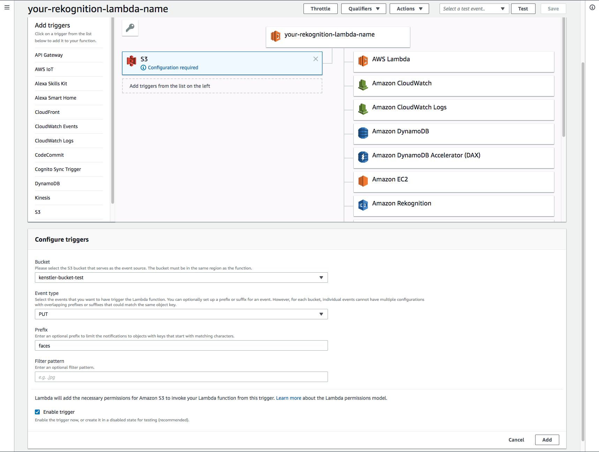

Then click "Add". Next, select the center box with your rekognition lambda's name. The menu at the bottom of the page will now let you manually enter the function code.

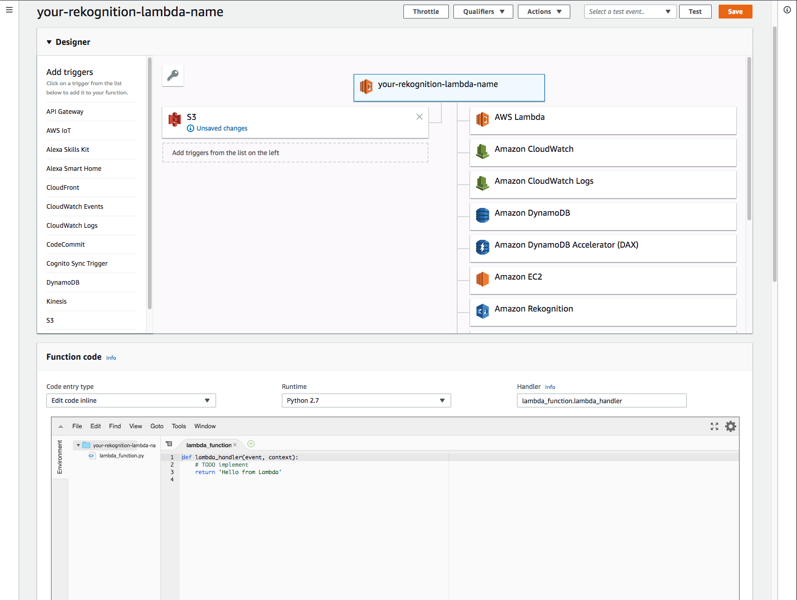

Next, you're going to copy and paste code we've provided you in this repo into the text editor in the lambda dashboard. You can find it under Challenge_2, "rekognize-emotions.py", but we've included it here as well for your convenience:

```python
from __future__ import print_function

import boto3
import urllib
import datetime

print('Loading function')

rekognition = boto3.client('rekognition')
cloudwatch = boto3.client('cloudwatch')


# --------------- Helper Function to call CloudWatch APIs ------------------

def push_to_cloudwatch(name, value):
    try:
        response = cloudwatch.put_metric_data(
            Namespace='string',
            MetricData=[
                {
                    'MetricName': name,
                    'Value': value,
                    'Unit': 'Percent'
                },
            ]
        )
        print("Metric pushed: {}".format(response))
    except Exception as e:
        print("Unable to push to cloudwatch\n e: {}".format(e))
        return True

# --------------- Helper Functions to call Rekognition APIs ------------------

def detect_faces(bucket, key):
    print("Key: {}".format(key))
    response = rekognition.detect_faces(Image={"S3Object":
                                               {"Bucket": bucket,
                                                "Name": key}},
                                        Attributes=['ALL'])

    if not response['FaceDetails']:
        print ("No Face Details Found!")
        return response

    push = False
    dynamo_obj = {}
    dynamo_obj['s3key'] = key

    for index, item in enumerate(response['FaceDetails'][0]['Emotions']):
        print("Item: {}".format(item))
        if int(item['Confidence']) > 10:
            push = True
            dynamo_obj[item['Type']] = str(round(item["Confidence"], 2))
            push_to_cloudwatch(item['Type'], round(item["Confidence"], 2))

    if push:  # Push only if at least on emotion was found
        table = boto3.resource('dynamodb').Table('rekognize-faces')
        table.put_item(Item=dynamo_obj)

    return response

# --------------- Main handler ------------------


def lambda_handler(event, context):
    '''Demonstrates S3 trigger that uses
    Rekognition APIs to detect faces, labels and index faces in S3 Object.
    '''

    # Get the object from the event
    bucket = event['Records'][0]['s3']['bucket']['name']
    key = urllib.unquote_plus(event['Records'][0]['s3']['object']['key'].encode('utf8'))
    try:
        # Calls rekognition DetectFaces API to detect faces in S3 object
        response = detect_faces(bucket, key)

        return response
    except Exception as e:
        print("Error processing object {} from bucket {}. ".format(key, bucket) +
              "Make sure your object and bucket exist and your bucket is in the same region as this function.")
        raise e
```

Plese take a look at what this script does. The Function `lambda_handler` handles the lambda script when it's triggered by an event, in this case the "PutObject" to your S3 bucket under the prefix "faces". The handler then calls the `detect_faces`, which does the following:

* Makes a `detect_faces` API call to Rekognition, handling an empty response
* Checks if any emotion scores are greater than 10
* If so, pushes emotion type and confidence score to CloudWatch
* If at least one emotion in the response is detected or significant, the record is stored in a DynamoDB table.

Once you've copy and pasted the code, we're almost ready to Save the function so it can start triggering.

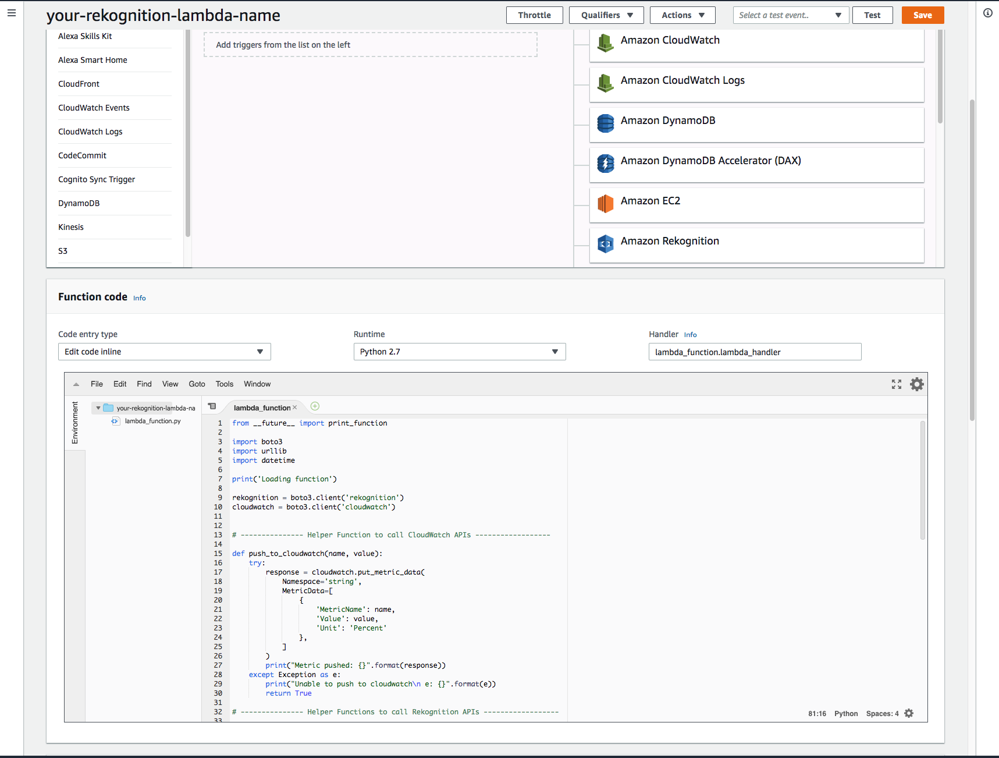

Before we do that, we need to create the DynamoDB table to store detected emotions and emotion scores.

## Create DynamoDB Table

Navigate to the DynamoDB dashboard by seraching "DynamDB" in the "Services" drop-down tab. Click "Create table" on the dashboard page (it may look different if you've created a table before).


Next:
* Under Table name: Enter the table specified in the lambda function, "rekognize-faces"
* Under primary key: Enter "s3key".


Then click create. Once created, go back to your lambda function and make sure to click "Save" at the top right. You lambda function is now active and should begin triggering upon face crop uploads.

## Emotion-tracking Dashboard using Cloudwatch

Now that we've created the lambda function for processing cropped faces and a DynamoDB table to record results, we're going to build the dashboard that is the center-piece of our application: real-time emotion tracking. At this point, you should have your IoT device running and collecting face crops if it hasn't been already.

Navigate to CloudWatch by searching for "CloudWatch" under the "Services" tab. Once at the dashboard, select "Dashboards" from the left side-bar.


Select "Create Dashboard", then enter your dashboard name.

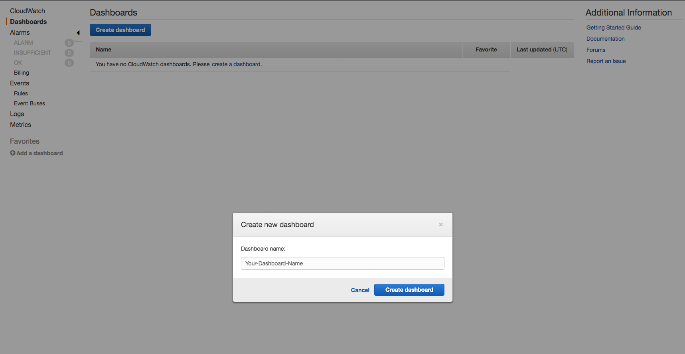

Then select "Line" widget and click "Configure".

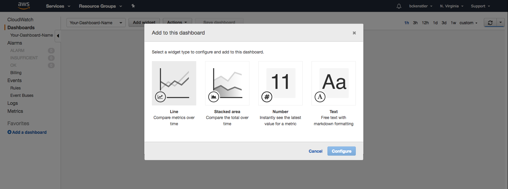

You'll then be able to configure your line widget. 

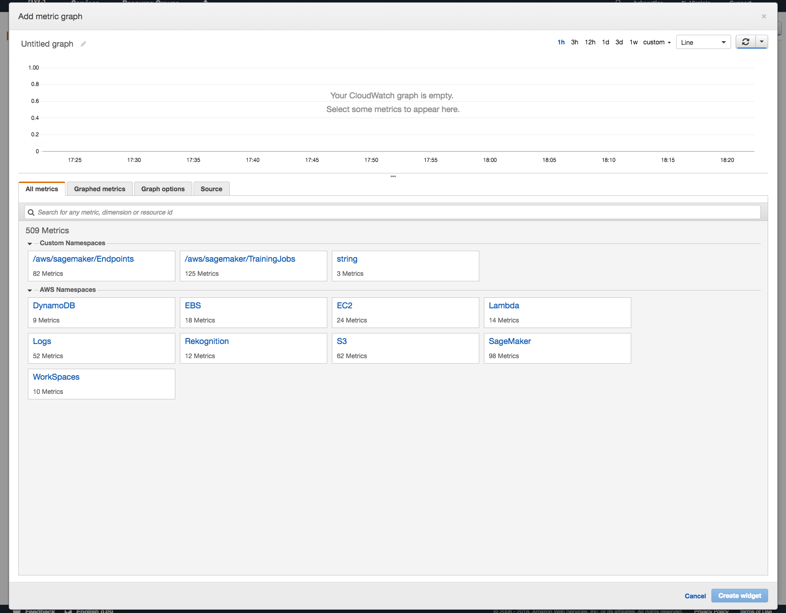

* Click on "Untitled graph" at the top left to name your graph. 
* In the "Metrics" menu, you should see a section that says "Custom Namespaces". 
* Click on "string" (if this is not there, your face crops haven't made it through the pipeline yet. Wait a few minutes).
* Click on "Metrics with no dimensions"
* Select all available metrics (there should be 7. These populate as the emotions are detected. If they're not all there, make some funny faces at your camera to get a range of detections.)

Then, click the tab "Graphed metrics"

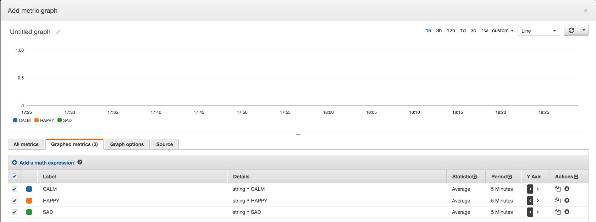

Here, you can change how your metrics are displayed. By default, point metrics shown are averages of 5 min. periods. You may want to change the granularity to a smaller period to actually start seeing line graphs being drawn.

In addition, make sure to turn on "Auto refresh" and set the interval to 10 seconds.

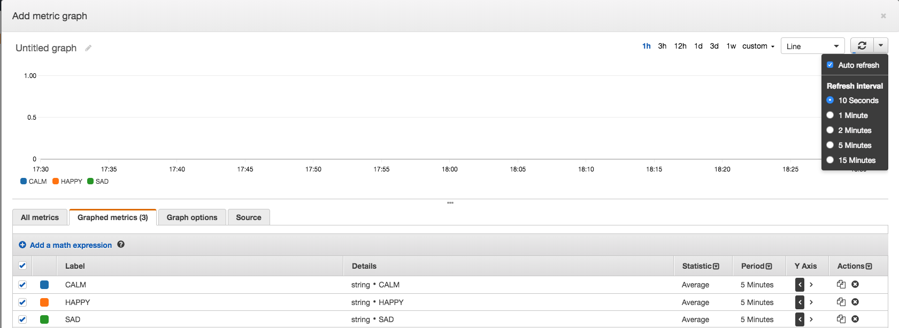

Finally, click "Create Widget" and you'll have successfully created the emotion tracking dashboard for your application! Now wait and see the results come in as your IoT device sends frames through your pipeline to detect emotions over time.

**To-do: CloudWatch Dashboard image with extensive data collected**


