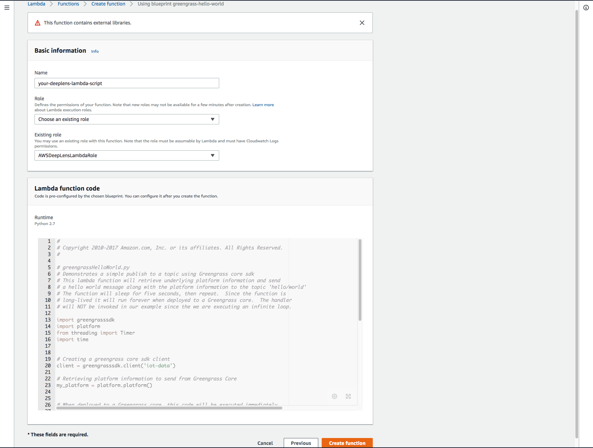
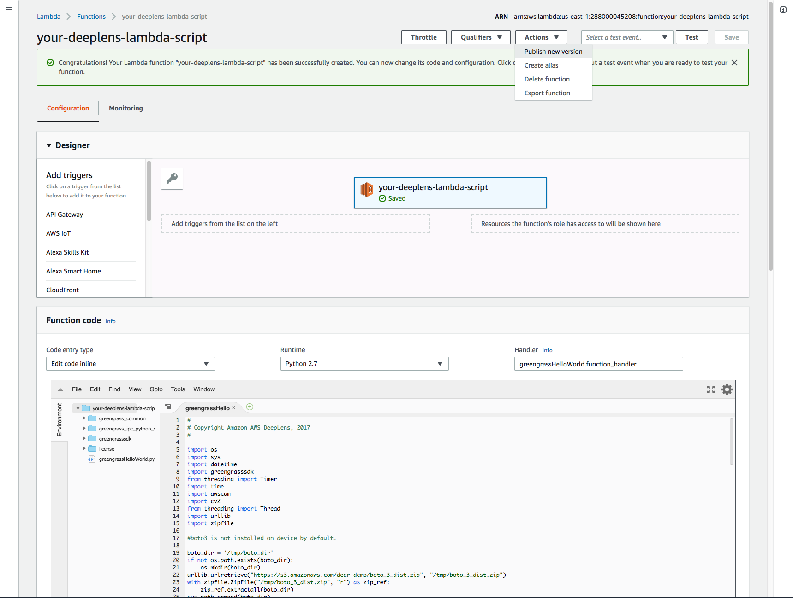
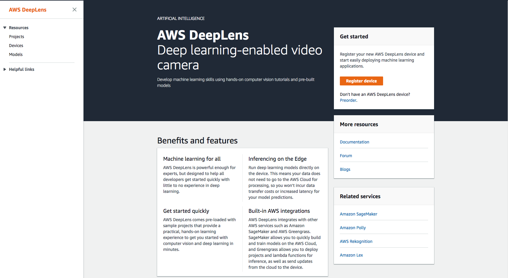
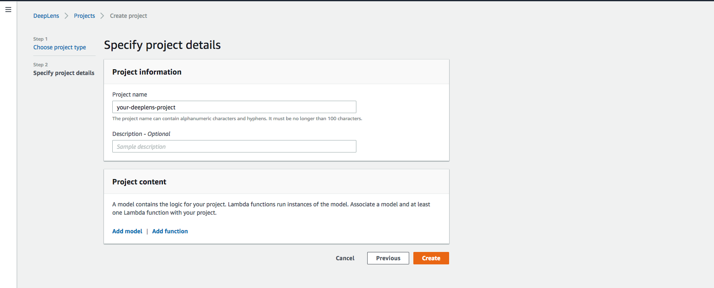
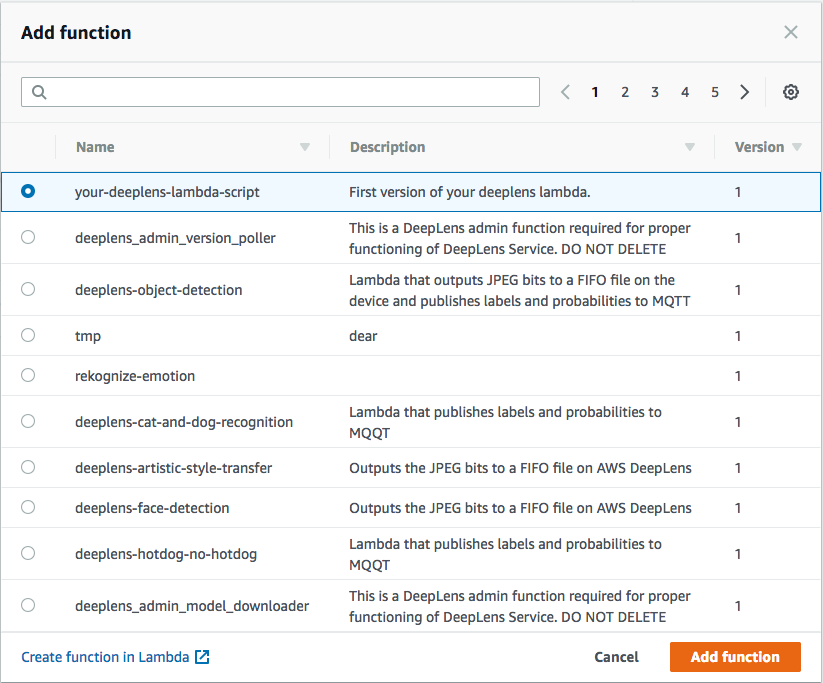
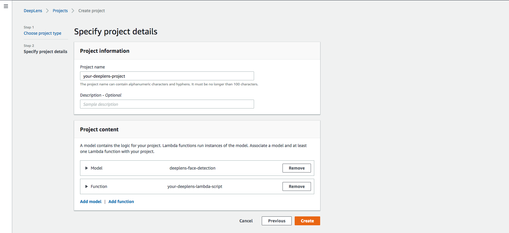
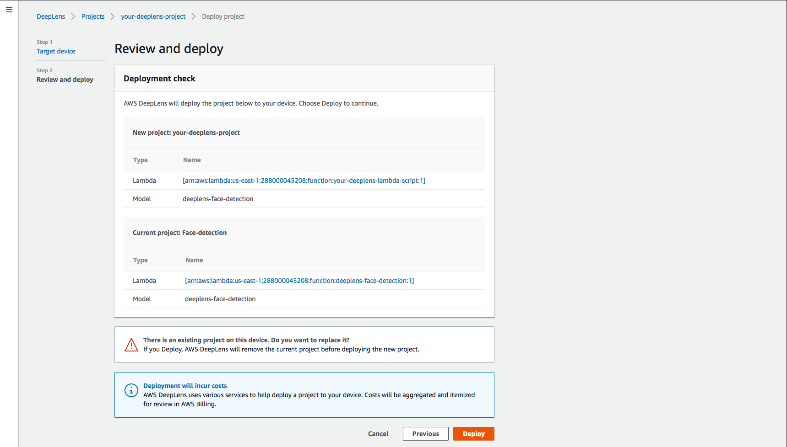

# Challenge 2: ML at the Edge
## Summary

Now that we've successfully built out a pipeline for our application based around cloud-inference, it's time to revisit this configuration. In ML/IoT pipelines, we often have a choice to make about where inference is ran. Recall that in this particular scenario, the face detection inference is acting as a gate to the Rekognition API call:
* Only trigger when a face is detected
* Only actually send the face crop

In the previous Challenge, we cited performance and speed as two advantages of cloud inference. Unfortunately, by keeping inference in the cloud our IoT devices must regularly send images at constant intervals (i.e. they're **always on**) and they send entire images. This seems like a waste of bandwidth; by putting face-detection inference at the edge, we can directly make Rekognition calls from the device itself. The tradeoff here is that while we're only sending face crops when there detected over the network, inference at the edge can be less performant.

In this challenge, you will swap out the ML/IoT part of the previous pipeline with a new pipeline that uses AWS DeepLens to run inference on the edge. DeepLens will then put face crops to the S3 bucket correctly, continuing the rest of the application pipeline.

* Step-by-step instructions (re:screenshots)
* Instructions on re-setting and registering DeepLens
* configure inference lambda for edge inference w/ S3 bucket
* Deploy lambda, model as a DeepLens Project to device

## Instructions

### AWS DeepLens Registration

Visit [AWS Management Console](https://console.aws.amazon.com/console/home?region=us-east-1). Make sure you are on US-East (N.Virginia) region.

Search for DeepLens in the search bar and select AWS DeepLens to open the console.

On the AWS DeepLens console screen, find the Get started section on the right hand side and select Register Device.


#### Step 1- Provide a name for your device.

Enter a name for your DeepLens device (for example, “MyDevice”), and select Next.


#### Step 2- Provide permissions

AWS DeepLens projects require different levels of permissions, which are set by AWS Identity and Access Management (IAM) roles. When registering your device for the first time, you'll need to create each one of these IAM roles.

#### Role 1- IAM role for AWS DeepLens

Select Create a role in IAM.


Use case is selected by default. Click Next:Permissions

Click Next:Review

Click Create role 


Return back to the Set Permission page, select on Refresh IAM roles and select the newly created Role name **AWSDeepLensServiceRole.**


#### Role 2- IAM role for AWS Greengrass 

Select Create a role in IAM.

Use case is selected by default. Click Next:Permissions

Click Next:Review

Click Create role 

Return back to the Set Permission page, select on Refresh IAM roles and select the newly created Role name **AWSDeepLensGreengrassRole.**

#### Role 3- IAM group role for AWS Greengrass

Select Create a role in IAM.
Use case is selected by default. Click Next:Permissions
Click Next:Review
Click Create role 
Return back to the Set Permission page, select on Refresh IAM roles and select the newly created Role name **AWSDeepLensGreengrassGroupRole.**

#### Role 4- IAM role for Amazon SageMaker

Select Create a role in IAM.
Use case is selected by default. Click Next:Permissions
Click Next:Review
Click Create role 
Return back to the Set Permission page, select on Refresh IAM roles and select the newly created Role name **AWSDeepLensSageMakerRole.**

#### Role 5- IAM role for AWS Lambda

Select Create a role in IAM.
Use case is selected by default. Click Next:Permissions
Click Next:Review
Click Create role 
Return back to the Set Permission page, select on Refresh IAM roles and select the newly created Role name **AWSDeepLensLambdaRole.**

Note: These roles are very important. Make sure that you select the right role for each one, as you can see in the screenshot.


Once you have all the roles correctly created and populated, select **Next.**

#### Step 3- Download certificate
In this step, you will download and save the required certificate to your computer. You will use it later to enable your DeepLens to connect to AWS.

Select Download certificate and note the location of the certificates.zip file. Select Register.


Note: Do not open the zip file. You will attach this zip file later on during device registration.

### Configure your DeepLens

In this step, you will connect the device to a Wi-Fi/Ethernet connection, upload the certificate and review your set-up. Then you're all set!

Power ON your device

<details> <summary>If you are connected over monitor setup </summary>
  
  Make sure the middle LED is blinking. If it is not, then use a pin to reset the device. The reset button is located at the back of the device
  
  Navigate to the setup page at **192.168.0.1.**
  
</details>
  
<details> <summary>If you are connected in headless mode </summary>
  
  Make sure the middle LED is blinking. If it is not, then use a pin to reset the device. The reset button is located at the back of the device
  
  Locate the SSID/password of the device’s Wi-Fi. You can find the SSID/password on the underside of the device.
  
  Connect to the device network via the SSID and provide the password
  
  Navigate to the setup page at **192.168.0.1.**
  
  
  
</details>

#### Step 4- Connect to your network

Select your local Wi-Fi network ID from the dropdown list and enter your WiFi password. If you are using ethernet, choose Use Ethernet option instead.

Select Save.


#### Step 5- Attach Certificates

Select Browse in the Certificate section. Select the zip file you downloaded in Step 4 

Select Next.


#### Step 6- Device set up.

If you are on the device summary page- Please do not make changes to the password.

Note: Instead, if you are presented with the below screen, type the device password as Aws2017! . 


#### Step 7- Select Finish


Congratulations! You have successfully registered and configured your DeepLens device. To verify, return to [AWS DeepLens console](https://console.aws.amazon.com/deeplens/home?region=us-east-1#projects) and select **Devices** in the left side navigation bar and verify that your device has completed the registration process. You should see a green check mark and Completed under Registration status.

### Create DeepLens Lambda

Now that you've registered your DeepLens device, it's time to create a custom project that we can deploy to the device to run face-detection and push crops to S3.

A DeepLens **Project** consists of two things:
* A model artifact: This is the model that is used for inference.
* A Lambda function: This is the script that runs inference on the device.

Before we deploy a project to DeepLens, we need to create a custom lambda function that will use the face-detection model on the device to detect faces and push crops to S3.

You will repeat the steps in Challenge 2 where you created a Lambda function from the "greengrass-hello-world" blueprint. This time, however, you will select "Choose an existing role" and then select "AWSDeepLensLambdaRole". 



Next, you will replace the default function with the inference-lambda.py script under Challenge_3, which we've included here for you:

**Note**: Be sure to replace "your-bucket" with the name of the bucket you've been using thus far.

```python
#
# Copyright Amazon AWS DeepLens, 2017
#

import os
import sys
import datetime
import greengrasssdk
from threading import Timer
import time
import awscam
import cv2
from threading import Thread
import urllib
import zipfile

#boto3 is not installed on device by default.

boto_dir = '/tmp/boto_dir'
if not os.path.exists(boto_dir):
    os.mkdir(boto_dir)
urllib.urlretrieve("https://s3.amazonaws.com/dear-demo/boto_3_dist.zip", "/tmp/boto_3_dist.zip")
with zipfile.ZipFile("/tmp/boto_3_dist.zip", "r") as zip_ref:
    zip_ref.extractall(boto_dir)
sys.path.append(boto_dir)

import boto3

# Creating a greengrass core sdk client
client = greengrasssdk.client('iot-data')

# The information exchanged between IoT and clould has
# a topic and a message body.
# This is the topic that this code uses to send messages to cloud
iotTopic = '$aws/things/{}/infer'.format(os.environ['AWS_IOT_THING_NAME'])

ret, frame = awscam.getLastFrame()
ret, jpeg = cv2.imencode('.jpg', frame)

Write_To_FIFO = True

class FIFO_Thread(Thread):
    def __init__(self):
        ''' Constructor. '''
        Thread.__init__(self)

    def run(self):
        fifo_path = "/tmp/results.mjpeg"
        if not os.path.exists(fifo_path):
            os.mkfifo(fifo_path)
        f = open(fifo_path, 'w')
        client.publish(topic=iotTopic, payload="Opened Pipe")
        while Write_To_FIFO:
            try:
                f.write(jpeg.tobytes())
            except IOError as e:
                continue

def push_to_s3(img, index):
    try:
        bucket_name = "your-bucket"

        timestamp = int(time.time())
        now = datetime.datetime.now()
        key = "faces/{}_{}/{}_{}/{}_{}.jpg".format(now.month, now.day,
                                                   now.hour, now.minute,
                                                   timestamp, index)

        s3 = boto3.client('s3')

        encode_param = [int(cv2.IMWRITE_JPEG_QUALITY), 90]
        _, jpg_data = cv2.imencode('.jpg', img, encode_param)
        response = s3.put_object(ACL='public-read',
                                 Body=jpg_data.tostring(),
                                 Bucket=bucket_name,
                                 Key=key)

        client.publish(topic=iotTopic, payload="Response: {}".format(response))
        client.publish(topic=iotTopic, payload="Face pushed to S3")
    except Exception as e:
        msg = "Pushing to S3 failed: " + str(e)
        client.publish(topic=iotTopic, payload=msg)

def greengrass_infinite_infer_run():
    try:
        modelPath = "/opt/awscam/artifacts/mxnet_deploy_ssd_FP16_FUSED.xml"
        modelType = "ssd"
        input_width = 300
        input_height = 300
        prob_thresh = 0.25
        results_thread = FIFO_Thread()
        results_thread.start()

        # Send a starting message to IoT console
        client.publish(topic=iotTopic, payload="Face detection starts now")

        # Load model to GPU (use {"GPU": 0} for CPU)
        mcfg = {"GPU": 1}
        model = awscam.Model(modelPath, mcfg)
        client.publish(topic=iotTopic, payload="Model loaded")
        ret, frame = awscam.getLastFrame()
        if ret == False:
            raise Exception("Failed to get frame from the stream")

        yscale = float(frame.shape[0]/input_height)
        xscale = float(frame.shape[1]/input_width)

        doInfer = True
        while doInfer:
            # Get a frame from the video stream
            ret, frame = awscam.getLastFrame()
            # Raise an exception if failing to get a frame
            if ret == False:
                raise Exception("Failed to get frame from the stream")

            # Resize frame to fit model input requirement
            frameResize = cv2.resize(frame, (input_width, input_height))

            # Run model inference on the resized frame
            inferOutput = model.doInference(frameResize)

            # Output inference result to the fifo file so it can be viewed with mplayer
            parsed_results = model.parseResult(modelType, inferOutput)['ssd']
            # client.publish(topic=iotTopic, payload = json.dumps(parsed_results))
            label = '{'
            for i, obj in enumerate(parsed_results):
                if obj['prob'] < prob_thresh:
                    break
                offset = 25
                xmin = int( xscale * obj['xmin'] ) + int((obj['xmin'] - input_width/2) + input_width/2)
                ymin = int( yscale * obj['ymin'] )
                xmax = int( xscale * obj['xmax'] ) + int((obj['xmax'] - input_width/2) + input_width/2)
                ymax = int( yscale * obj['ymax'] )

                crop_img = frame[ymin:ymax, xmin:xmax]

                push_to_s3(crop_img, i)

                cv2.rectangle(frame, (xmin, ymin), (xmax, ymax), (255, 165, 20), 4)
                label += '"{}": {:.2f},'.format(str(obj['label']), obj['prob'] )
                label_show = '{}: {:.2f}'.format(str(obj['label']), obj['prob'] )
                cv2.putText(frame, label_show, (xmin, ymin-15),
                            cv2.FONT_HERSHEY_SIMPLEX, 0.5, (255, 165, 20), 4)
            label += '"null": 0.0'
            label += '}'
            client.publish(topic=iotTopic, payload=label)
            global jpeg
            ret, jpeg = cv2.imencode('.jpg', frame)

    except Exception as e:
        msg = "Test failed: " + str(e)
        client.publish(topic=iotTopic, payload=msg)

    # Asynchronously schedule this function to be run again in 15 seconds
    Timer(15, greengrass_infinite_infer_run).start()


# Execute the function above
greengrass_infinite_infer_run()


# This is a dummy handler and will not be invoked
# Instead the code above will be executed in an infinite loop for our example
def function_handler(event, context):
    return
```

Once you've copied and pasted the code, click "Save" as before, and this time you'll also click "Actions" and then "Publish new version".



Then, enter a brief description and click "Publish."


Before we can run this lambda on the device, we need to attach the right permissions to the right roles. While we assigned a role to this lambda, "AWSDeepLensLambdaRole", it's only a placeholder. Lambda's deployed through greengrass actually inherit their policy through a greengrass group role.

Similar to what we did in challenge 2, we need to add permissions to this role for the lambda function to access S3. To do this, go to the IAM dashboard, find the "AWSDeepLensGreenGrassGroupRole", and attach the policy "AmazonS3FullAccess". If you've forgotten how to do this, please refer to Challenge 2 as an example.

### Create & Deploy DeepLens Project

With the lambda created, we can now make a project using it and the built-in face detection model.

From the DeepLens homepage dashboard, select "Projects" from the left side-bar:



Then select "Create new project"


Next, select "Create a new blank project" then click "Next".


Now, name your deeplens project.



Next, select "Add model". From the pop-up window, select "deeplens-face-detection" then click "Add model".


Next, select "Add function". from the pop-up window, select your deeplens lambda function and click "Add function".



Finally, click "Create".



Now that the project has been created, you will select your project from the project dashboard and click "Deploy to device".


Select the device you're deploying too, then click "Review" (your screen will look different here).


Finally, click "Deploy" on the next screen to begin project deployment.



You should now start to see deployment status. Once the project has been deployed, your deeplens will now start processing frames and running face-detection locally. When faces are detected, it will push to your S3 bucket. Everything else in the pipeline remains the same, so return to your dashboard to see the new results coming in!

**Note**: If your model download progress hangs at a blank state (Not 0%, but **blank**) then you may need to reset greengrass on DeepLens. To do this, log onto the DeepLens device, open up a terminal, and type the following command:
`sudo systemctl restart greengrassd.service --no-block`. After a couple minutes, you model should start to download.
